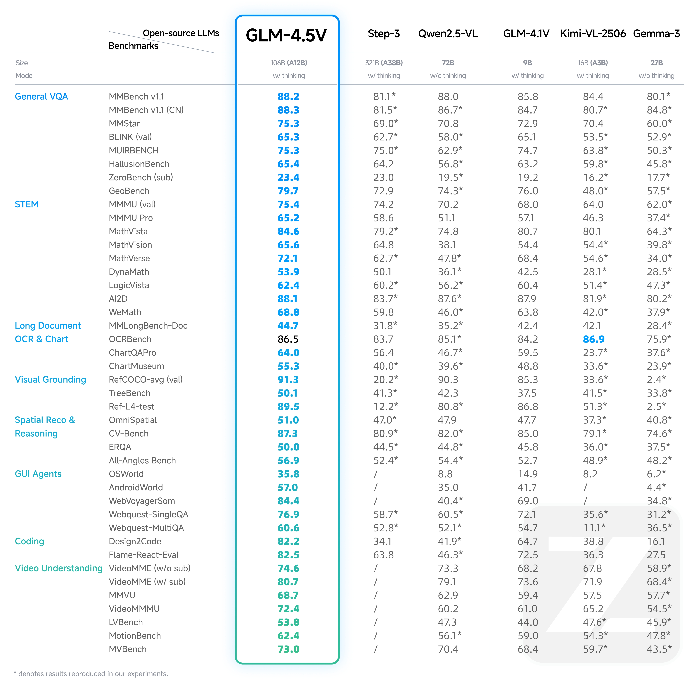

# GLM-V

[Read this in English.](./README.md)

<div align="center">

</div>
<p align="center">
    👋 加入我们的 <a href="resources/WECHAT.md" target="_blank">微信</a> 和 <a href="https://discord.com/invite/8cnQKdAprg" target="_blank">Discord</a> 社区。
    <br>
    📖 查看 <a href="https://arxiv.org/abs/2507.01006" target="_blank">论文</a> 。
    <br>
    📍<a href="https://chat.z.ai/" target="_blank">在线体验</a> ，或使用 <a href="https://docs.z.ai/guides/vlm/glm-4.5v" target="_blank">API</a>。
</p>

## 简介

视觉语言大模型（VLM）已经成为智能系统的关键基石。随着真实世界的智能任务越来越复杂，VLM模型也亟需在基本的多模态感知之外，逐渐增强复杂任务中的推理能力，提升自身的准确性、全面性和智能化程度，使得复杂问题解决、长上下文理解、多模态智能体等智能任务成为可能。
我们希望通过我们的开源工作，与社区一起探索技术前沿，同时赋能更多开发者发挥创意做出更多好玩的应用。

**本开源仓库包含了我们开发的`GLM-4.5V` 和 `GLM-4.1V` 系列模型**。模型性能及简介请参见 [模型介绍章节](#模型介绍)。我们也总结了一些模型已知的问题，请移步 [已修复及仍存在的问题章节](#已修复及仍存在的问题)。

## 项目更新

- 🔥 **News**: `2025/08/11`: 我们发布了 **GLM-4.5V**，多项指标大幅度提升。我们同步开源了我们工程同学手搓的调试用**桌面小助手应用**，接入GLM-4.5V后能够通过截屏、录屏等方式获取PC屏幕上的视觉信息，欢迎试玩和魔改，打造自己的多模态小助手，点击 [这里](https://huggingface.co/spaces/zai-org/GLM-4.5V-Demo-App) 下载安装包或 [自行构建](examples/vllm-chat-helper/README.md) ！
- **News**: `2025/07/16`: 我们已经开源了训练 GLM-4.1V-Thinking 使用的 **VLM 奖励系统**。 查看[代码仓库](glmv_reward) 并在本地运行：`python examples/reward_system_demo.py`。
- **News**: `2025/07/01`: 我们发布了 **GLM-4.1V-9B-Thinking** 模型和其[技术报告](https://arxiv.org/abs/2507.01006)。

## 模型实现代码

- GLM-4.5V 模型算法代码请参考 [transformers](https://github.com/huggingface/transformers/tree/main/src/transformers/models/glm4v_moe) 的完整实现。
- GLM-4.1V-9B-Thinking 模型算法代码请参考 [transformers](https://github.com/huggingface/transformers/tree/main/src/transformers/models/glm4v) 的完整实现。
- 这两个模型的多模态预处理办法完全相同，但是对话模板不同，请仔细甄别。

## 模型下载地址

| 模型                   | 下载地址                                                                                                                                                  | 模型类型   |
|----------------------|-------------------------------------------------------------------------------------------------------------------------------------------------------|--------|
| GLM-4.5V             | [🤗 Hugging Face](https://huggingface.co/zai-org/GLM-4.5V)<br> [🤖 ModelScope](https://modelscope.cn/models/ZhipuAI/GLM-4.5V)                         | 混合推理模型 |
| GLM-4.5V-FP8         | [🤗 Hugging Face](https://huggingface.co/zai-org/GLM-4.5V-FP8)<br> [🤖 ModelScope](https://modelscope.cn/models/ZhipuAI/GLM-4.5V-FP8)                 | 混合推理模型 |
| GLM-4.1V-9B-Thinking | [🤗 Hugging Face](https://huggingface.co/zai-org/GLM-4.1V-9B-Thinking)<br> [🤖 ModelScope](https://modelscope.cn/models/ZhipuAI/GLM-4.1V-9B-Thinking) | 推理模型   |
| GLM-4.1V-9B-Base     | [🤗 Hugging Face](https://huggingface.co/zai-org/GLM-4.1V-9B-Base)<br> [🤖 ModelScope](https://modelscope.cn/models/ZhipuAI/GLM-4.1V-9B-Base)         | 基座模型   |

## 示例

### 定位（Grounding）

GLM-4.5V 具备精确的定位能力。给定一个请求定位特定物体的提示词，GLM-4.5V 能够逐步推理并识别目标物体的边界框。查询提示支持对目标物体的复杂描述，以及指定输出格式，例如：
>
> - 帮我在图像中找到 <expr> 并给出它的边界框。
> - 请根据给定的描述 <expr>，标出图像中的边界框 [[x1,y1,x2,y2], …]。

其中 `<expr>` 是对目标物体的描述。输出的边界框是一个四元组 $$[x_1,y_1,x_2,y_2]$$，由左上角和右下角的坐标组成，其中每个值按图像宽度（x 坐标）或高度（y 坐标）归一化，并乘以 1000 进行缩放。

在响应中，特殊标记 `<|begin_of_box|>` 和 `<|end_of_box|>` 用于标记答案中的图像边界框。括号的样式可能不同（[], [[]], (), <>, 等），但含义相同：括住框的坐标。

### GUI Agent

- `examples/gui-agent`：演示了 GUI Agent 的提示构建和输出处理，包括针对移动端、PC 和网页的策略。提示模板在 GLM-4.1V 和 GLM-4.5V 之间有所不同。

### APP实例

- `examples/vlm-helper`：一个面向 GLM 多模态模型（主要是 GLM-4.5V，兼容 GLM-4.1V）的桌面助手，支持文本、图片、视频、PDF、PPT 等多种格式。通过连接 GLM 多模态 API，在多场景下提供智能服务。可[下载安装包](https://huggingface.co/spaces/zai-org/GLM-4.5V-Demo-App)或[从源码构建](examples/vlm-helper/README.md)。

## 快速上手

### 环境安装

请按照 `requirements.txt` 中的自行安装。

```bash
pip install -r requirements.txt
```

+ vLLM 和 SGLang 依赖可能冲突，建议每个环境中只安装其中一个。

### transformers

- `trans_infer_cli.py`: 使用`transformers`库作为推理后端的命令行交互脚本。你可以使用它进行连续对话。
- `trans_infer_gradio.py`: 使用`transformers`库作为推理后段的 Gradio 界面脚本，搭建一个可以直接使用的 Web 界面，支持图片，视频，PDF，PPT等多模态输入。
- `trans_infer_bench`：用于学术复现的推理脚本，仅适用于 `GLM-4.1V-9B-Thinking` 模型。其核心在于指定了中断思考的长度，当思考长度超过`8192`时，强制中断思考并补上`</think><answer>`再次发起请求，让模型直接输出答案。该例子中使用的一个视频作为输入的测试的例子。其他情况需自行修改。

### vLLM

```shell
vllm serve zai-org/GLM-4.5V \
     --tensor-parallel-size 4   \
     --tool-call-parser glm45   \
     --reasoning-parser glm45   \
     --enable-auto-tool-choice  \
     --served-model-name glm-4.5v \
     --allowed-local-media-path / \
     --media-io-kwargs '{"video": {"num_frames": -1}}'
```

### SGLang

```shell
python3 -m sglang.launch_server --model-path zai-org/GLM-4.5V \
     --tp-size 4  \
     --tool-call-parser glm45 \
     --reasoning-parser glm45 \
     --served-model-name glm-4.5v \
     --port 8000 
     --host 0.0.0.0 
```

注意事项:

- `SGLang` 框架建议使用 `FA3` 注意力后端，支持更高的推理性能和更低的显存占用，可添加 `--attention-backend fa3 --mm-attention-backend fa3 --enable-torch-compile`开启。在部分较大的视频推理时，不启用`FA3` 注意力后端会导致显存溢出。同时，我们建议设置更大的`SGLANG_VLM_CACHE_SIZE_MB`，以提供足够的缓存空间用于视频理解。例如`1024`。
- 使用`vLLM`和`SGLang`时，发送请求时默认启用思考模式。如果要禁用思考开关，需要添加
  `extra_body={"chat_template_kwargs": {"enable_thinking": False}}`参数。

## 模型微调

[LLaMA-Factory](https://github.com/hiyouga/LLaMA-Factory) 已经支持 GLM-4.5V & GLM-4.1V-9B-Thinking 模型的微调。以下是构建数据集的说明，这是一个使用了两张图片的数据集。你需要将数据集整理为 `finetune.json`, 这里是一个 GLM-4.1V-9B 微调的例子。

```json
[
  {
    "messages": [
      {
        "content": "<image>Who are they?",
        "role": "user"
      },
      {
        "content": "<think>\nUser ask me to observe the image and get the answer. I Know they are Kane and Gretzka from Bayern Munich.</think>\n<answer>They're Kane and Gretzka from Bayern Munich.</answer>",
        "role": "assistant"
      },
      {
        "content": "<image>What are they doing?",
        "role": "user"
      },
      {
        "content": "<think>\nI need to observe what this people are doing. Oh, They are celebrating on the soccer field.</think>\n<answer>They are celebrating on the soccer field.</answer>",
        "role": "assistant"
      }
    ],
    "images": [
      "mllm_demo_data/1.jpg",
      "mllm_demo_data/2.jpg"
    ]
  }
]
```

1. `<think> XXX </think>` 中的部分不会被存放为历史记录和微调。
2. `<image>` 标签会被替换成图片信息。
3. 对于 `GLM-4.5V` 模型，`<answer>` 和 `</answer>` 标签应该删除。

接着，即可按照 LLaMA-Factory 的微调方式进行微调。

## 模型介绍

### GLM-4.5V

GLM-4.5V 基于智谱新一代旗舰文本基座模型 GLM-4.5-Air（106B参数，12B激活），延续 GLM-4.1V-Thinking 技术路线，在 42 个公开视觉多模态榜单中综合效果达到同级别开源模型 SOTA 性能，涵盖图像、视频、文档理解以及 GUI Agent 等常见任务。



在多模态榜单之外，我们更重视模型在真实场景下的表现与可用性。GLM-4.5V 通过高效混合训练，具备覆盖不同种视觉内容的处理能力，实现全场景视觉推理，包括：
- 图像推理（场景理解、复杂多图分析、位置识别）
- 视频理解（长视频分镜分析、事件识别）
- GUI 任务（屏幕读取、图标识别、桌面操作辅助）
- 复杂图表与长文档解析（研报分析、信息提取）
- Grounding 能力（精准定位视觉元素）

同时，模型新增 “思考模式” 开关，用户可灵活选择快速响应或深度推理，平衡效率与效果，该开关的使用方式与`GLM-4.5` 语言模型相同。

### GLM-4.1V-9B

基于 [GLM-4-9B-0414](https://github.com/zai-org/GLM-4) 基座模型，我们推出新版VLM开源模型 **GLM-4.1V-9B-Thinking**
，引入思考范式，通过课程采样强化学习 RLCS（Reinforcement Learning with Curriculum Sampling）全面提升模型能力，
达到 10B 参数级别的视觉语言模型的最强性能，在18个榜单任务中持平甚至超过8倍参数量的 Qwen-2.5-VL-72B。
我们同步开源基座模型 **GLM-4.1V-9B-Base**，希望能够帮助更多研究者探索视觉语言模型的能力边界。


与上一代的 CogVLM2 及 GLM-4V 系列模型相比，**GLM-4.1V-Thinking** 有如下改进：

1. 系列中首个推理模型，不仅仅停留在数学领域，在多个子领域均达到世界前列的水平。
2. 支持 **64k** 上下长度。
3. 支持**任意长宽比**和高达 **4k** 的图像分辨率。
4. 提供支持**中英文双语**的开源模型版本。

GLM-4.1V-9B-Thinking 通过引入「思维链」（Chain-of-Thought）推理机制，在回答准确性、内容丰富度与可解释性方面，
全面超越传统的非推理式视觉模型。在28项评测任务中有23项达到10B级别模型最佳，甚至有18项任务超过8倍参数量的Qwen-2.5-VL-72B。


## 已修复及仍存在的问题

自GLM-4.1V开源以来，我们也收到了许多社区反馈，深知模型仍有许多不足。在这一版GLM-4.5V中，我们尝试修复了一些常见问题，例如thinking复读、输出格式错误等，在新版本中有所缓解。

模型仍存在一些局限性及问题，我们将尽快修复

1. 在前端代码复刻案例中，模型会倾向于直接输出HTML代码，而没有正确包裹在markdown格式中，另外存在部分字符转义问题，导致直接进行前端渲染时可能遇到问题，非常抱歉。我们提供了一个简单的 [修复脚本](inference/html_detector.py)，能够在大部分情况下添加markdown标识及处理转义。
2. GLM-4.5V的纯文本问答能力仍有较大提升空间，在这次模型研发中我们主要关注视觉多模态场景，后续将同步提升纯文本能力。
3. 一些情况下仍然存在过度思考甚至复读的问题，尤其是复杂prompt场景。
4. 一些情况下模型会在最后复述一遍答案。
5. 存在一些感知问题，在数数、识别具体人物等方面有提升空间。

感谢大家的耐心和包容，也非常欢迎在 issue 区给我们提意见和建议，我们会尽可能回复并修正！

## 引用论文

如果您使用了本模型，请引用以下论文：

```bibtex
@misc{vteam2025glm45vglm41vthinkingversatilemultimodal,
      title={GLM-4.5V and GLM-4.1V-Thinking: Towards Versatile Multimodal Reasoning with Scalable Reinforcement Learning}, 
      author={V Team and Wenyi Hong and Wenmeng Yu and Xiaotao Gu and Guo Wang and Guobing Gan and Haomiao Tang and Jiale Cheng and Ji Qi and Junhui Ji and Lihang Pan and Shuaiqi Duan and Weihan Wang and Yan Wang and Yean Cheng and Zehai He and Zhe Su and Zhen Yang and Ziyang Pan and Aohan Zeng and Baoxu Wang and Bin Chen and Boyan Shi and Changyu Pang and Chenhui Zhang and Da Yin and Fan Yang and Guoqing Chen and Jiazheng Xu and Jiale Zhu and Jiali Chen and Jing Chen and Jinhao Chen and Jinghao Lin and Jinjiang Wang and Junjie Chen and Leqi Lei and Letian Gong and Leyi Pan and Mingdao Liu and Mingde Xu and Mingzhi Zhang and Qinkai Zheng and Sheng Yang and Shi Zhong and Shiyu Huang and Shuyuan Zhao and Siyan Xue and Shangqin Tu and Shengbiao Meng and Tianshu Zhang and Tianwei Luo and Tianxiang Hao and Tianyu Tong and Wenkai Li and Wei Jia and Xiao Liu and Xiaohan Zhang and Xin Lyu and Xinyue Fan and Xuancheng Huang and Yanling Wang and Yadong Xue and Yanfeng Wang and Yanzi Wang and Yifan An and Yifan Du and Yiming Shi and Yiheng Huang and Yilin Niu and Yuan Wang and Yuanchang Yue and Yuchen Li and Yutao Zhang and Yuting Wang and Yu Wang and Yuxuan Zhang and Zhao Xue and Zhenyu Hou and Zhengxiao Du and Zihan Wang and Peng Zhang and Debing Liu and Bin Xu and Juanzi Li and Minlie Huang and Yuxiao Dong and Jie Tang},
      year={2025},
      eprint={2507.01006},
      archivePrefix={arXiv},
      primaryClass={cs.CV},
      url={https://arxiv.org/abs/2507.01006}, 
}
```
