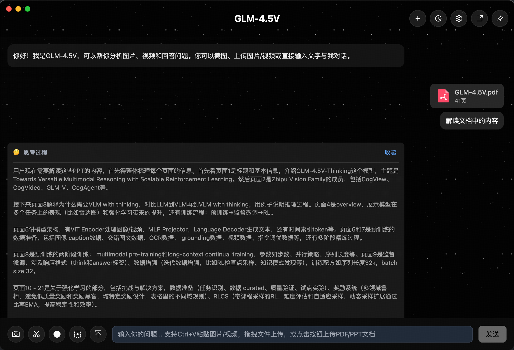
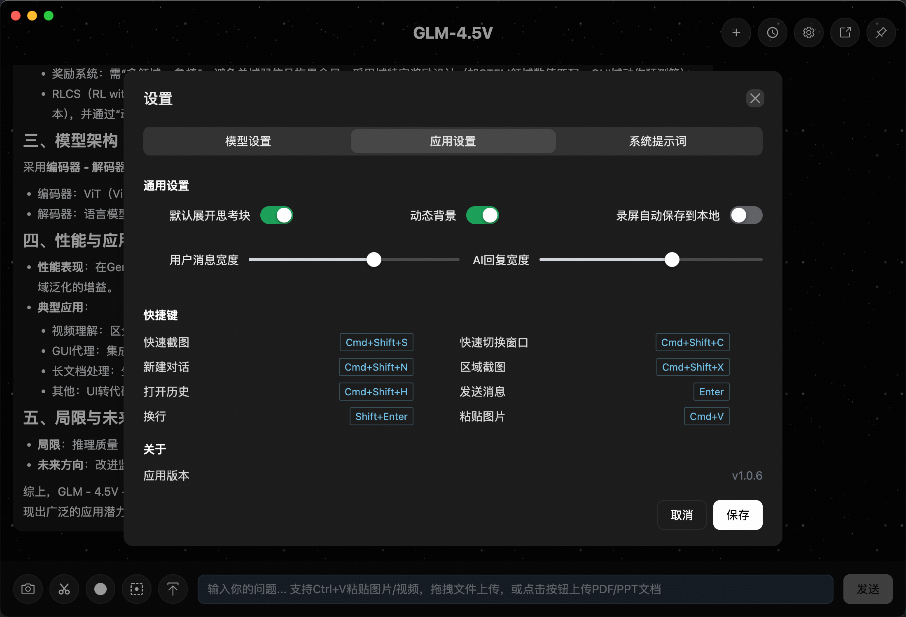

# VLM Chat Helper - 构建说明

一个面向 GLM 系列多模态模型（GLM-4.5V，兼容 GLM-4.1V）的桌面助手，支持文字、图片、视频、PDF、PPT 等多种格式的对话交互。
通过与 GLM 多模态 API 对接，实现从多场景智能服务。[安装包](https://huggingface.co/spaces/zai-org/GLM-4.5V-Demo-App) 可直接使用。

## 应用截图展示





## 特别提示

- 当前版本 **仅支持 macOS Apple Silicon（M 系列芯片：M1/M2/M3 等）**
- Intel 芯片 Mac、Windows 和 Linux 版本暂不提供

---

## macOS 安全限制提示

macOS 下载的应用第一次运行可能会提示“应用已损坏”或“无法打开”，这是因为系统为下载文件添加了安全隔离属性。
如果你确认应用来源可信，可以通过以下命令解除隔离：

```bash
xattr -rd com.apple.quarantine /Applications/vlm-helper.app
```

## 主要特性

- 🤖 **多模态聊天**：支持文字、图片、视频、PDF、PPT 文件的智能对话
- 📸 **截图功能**：快速截图和区域截图，支持全局快捷键
- 🎥 **录屏功能**：全屏录制和区域录制，自动视频压缩
- 🪟 **悬浮窗模式**：小巧的悬浮聊天窗口，随时随地使用
- 🎨 **主题支持**：内置多种代码高亮主题
- 📱 **拖拽上传**：支持直接拖拽文件到聊天界面
- ⌨️ **快捷键操作**：丰富的全局快捷键支持
- 💾 **本地存储**：聊天记录本地数据库存储

## 技术栈

- **前端框架**：Vue 3 + TypeScript
- **桌面应用**：Electron
- **UI 组件库**：Naive UI
- **CSS 框架**：UnoCSS
- **数据库**：Better-SQLite3
- **构建工具**：Electron Vite
- **包管理器**：pnpm

## 系统要求

- **Node.js**: >= 18.0.0
- **pnpm**: >= 8.0.0
- **操作系统**: Windows 10+, macOS 10.15+, Ubuntu 18.04+

## 快速开始

### 1. 安装依赖

```bash
pnpm install
````

### 2. 开发模式运行

```bash
pnpm dev
```

### 3. 构建应用

```bash
# 构建所有平台
pnpm build

# 构建 Windows 版本
pnpm build:win

# 构建 macOS 版本
pnpm build:mac

# 构建 Linux 版本
pnpm build:linux

# 仅构建不打包
pnpm build:unpack
```

## 项目结构

```
vlm-chat-helper/
├── src/
│   ├── main/                 # 主进程代码
│   │   ├── index.ts         # 主进程入口
│   │   ├── modules/         # 功能模块
│   │   │   ├── windowManager.ts    # 窗口管理
│   │   │   ├── shortcutManager.ts  # 快捷键管理
│   │   │   ├── recordingManager.ts # 录屏管理
│   │   │   └── ipcHandlers.ts      # IPC 处理器
│   │   ├── services/        # 服务层
│   │   │   └── database.ts  # 数据库服务
│   │   └── utils/           # 工具函数
│   ├── preload/             # 预加载脚本
│   │   └── index.ts        # 预加载入口
│   └── renderer/            # 渲染进程代码
│       └── src/
│           ├── App.vue      # 主应用组件
│           ├── main.ts      # 渲染进程入口
│           ├── components/  # 公共组件
│           ├── views/       # 页面视图
│           ├── stores/      # 状态管理
│           ├── composables/ # 组合式函数
│           └── utils/       # 工具函数
├── build/                   # 构建资源
├── resources/               # 应用资源
├── package.json            # 项目配置
├── electron.vite.config.ts # Electron Vite 配置
└── electron-builder.yml    # 打包配置
```

## 配置说明

### FFmpeg 配置

应用使用 FFmpeg 进行视频压缩，已集成 `ffmpeg-static-electron` 包，无需单独安装。

### 数据库配置

应用使用 Better-SQLite3 作为本地数据库，数据文件会自动创建在用户数据目录中。

## 开发命令

```bash
# 安装依赖
pnpm install

# 开发模式
pnpm dev

# 类型检查
pnpm typecheck

# 代码检查
pnpm lint

# 格式化代码
pnpm format

# 重建 native 模块
pnpm rebuild

# 构建项目
pnpm build

# 构建并进行类型检查
pnpm build:with-typecheck
```

## 兼容性说明

本项目当前仅支持 **macOS Apple Silicon M系列** 芯片。
